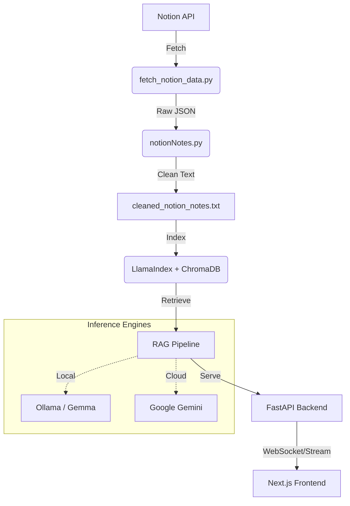

# 🚀 Notion RAG Chatbot

A professional-grade RAG (Retrieval-Augmented Generation) pipeline that turns your private Notion notes into an interactive, intelligent chatbot. Features multiple reasoning modes, including a "Thinking Mode" powered by agentic workflows.

---

## 🏗️ Architecture



## ✨ Features

- **Multi-Source Ready**: Built to handle Notion pages and attached `.ipynb` notebooks.
- **Thinking Mode**: Uses an `AgentWorkflow` to reason through complex queries before answering.
- **Fast Mode**: Direct vector search for quick information retrieval.
- **Persistent Storage**: Uses ChromaDB to avoid re-indexing unchanged notes.
- **Real-time Streaming**: Fluid UI with WebSocket and Server-Sent Events support.

## 🛠️ Setup

### 1. Prerequisites
- [Ollama](https://ollama.com/) (for local LLM support)
- [Node.js](https://nodejs.org/) (v18+)
- [Python](https://www.python.org/) (3.10+)

### 2. Backend Setup
1. Navigate to `backend/`.
2. Create a virtual environment: `python -m venv venv`.
3. Install dependencies: `pip install -r requirements.txt`.
4. Configure `.env` (use `.env.example` as a template):
   - `NOTION_TOKEN`: Your Notion Internal Integration Token.
   - `NOTION_PAGE_ID`: The ID of the page you want to index.
   - `GOOGLE_API_KEY`: (Optional) For Gemini support.

### 3. Data Ingestion
Run the following to pull your data from Notion:
```bash
python notionNotes.py
```

### 4. Frontend Setup
1. Navigate to `notion-chatbot/`.
2. Install dependencies: `npm install`.
3. Start the dev server: `npm run dev`.

---

## 🛡️ Privacy & Security
This project is designed with privacy in mind. **Your Notion data is never uploaded to a third-party server** (unless you explicitly use the Gemini cloud model). All indexing and vector storage happen locally in the `chroma_db` folder.

## 📄 License
MIT License. Feel free to use and contribute!
